# 🎧 soundsummary — 강의 녹음 요약 AI (Frontend)

브라우저에서 **실시간 녹음** 또는 **오디오 파일 업로드**로 강의/회의를 요약하고, 로컬 폴더에 결과를 저장하는 VSCode 스타일 웹앱입니다. 백엔드 없이도 Mock 요약을 생성하며, File System Access API를 이용해 실제 폴더 구조를 그대로 다룹니다.

## 주요 기능

- 실시간 녹음/파일 업로드: MediaRecorder 기반 녹음, 다중 오디오 업로드, Markdown 렌더링
- 로컬 저장: `summary/<workspace>/<subject>/` 경로에 원본 오디오, `data.json`, `summary.html` 저장
- 탭 인터페이스: 요약 결과별 탭 열기/전환/닫기, 중복 열림 방지
- 로컬 디렉토리 트리: 브라우저 내 파일 탐색기, 우클릭 컨텍스트 메뉴(새 폴더, 삭제, Workspace/Subject 지정)
- 단축키: `Ctrl/Cmd + N` 새 세션, `Ctrl/Cmd + R` 녹음 시작/중지
- 테마/모달 UX: 라이트/다크 전환, 녹음/업로드 모달 최소화/복원, 최근 요약 미리보기

## 빠른 시작

1. 크롬/엣지에서 `index.html`을 로컬 웹서버로 열기
   - File System Access API 때문에 `http://localhost`에서 여는 것을 권장합니다. (예: `python -m http.server 8000`)
2. 좌측 “로컬 디렉토리” 패널에서 **폴더 열기** 버튼으로 `summary` 루트 폴더 선택
   - 처음 선택 시 브라우저 권한 허용 필요. 이후 자동 복원됩니다.
3. 메인 화면에서 **실시간 녹음** 또는 **파일 업로드** 선택 → 모달에서 Workspace/Subject 입력 → **요약 생성** 클릭
4. 생성된 요약은 탭으로 열리고, 동일 경로에 `data.json`과 `summary.html`이 저장됩니다. 오디오 탭에서 원본 파일 재생 가능.

## Mock 모드 (기본값)

- `script.js`의 `API_CONFIG.useMockMode`가 기본 `true`라 백엔드 없이도 동작합니다.
- 버튼을 누르면 임의 요약문과 화자 구분 텍스트를 생성하고, 업로드/녹음한 실제 오디오를 그대로 연결합니다.

## 백엔드 연동 (선택)

백엔드를 띄우는 경우:

1. `script.js`에서 `API_CONFIG.baseURL`을 백엔드 주소로 설정
2. `API_CONFIG.useMockMode = false`로 변경
3. 서버 구동 후 요약 생성 시 실제 응답을 표시합니다. 실패하면 자동으로 Mock 데이터를 사용하도록 방어 로직이 있습니다.

## 디렉토리 구조

- `index.html` : 메인 레이아웃, 모달/패널 구조, 아이콘/단축키 정의
- `styles.css` : VSCode 느낌의 사이드바/탭/모달 스타일, 라이트/다크 테마
- `script.js` : 녹음/업로드 로직, 요약 생성/저장, 로컬 폴더 트리, 탭 관리, Mock/백엔드 처리
- `js/ui.js`, `js/state.js` : UI 헬퍼와 상태 관리 보조 스크립트

## 사용법 & 화면 예시

1. 기본 화면 / 방법 선택  
   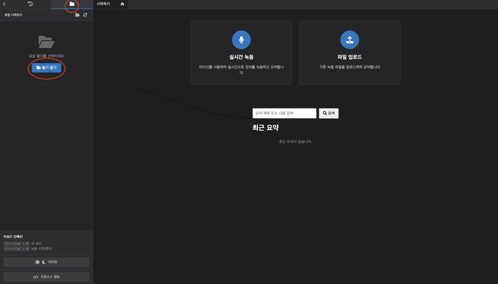
   첫 페이지는 위 사진과 같다. 먼저 요약파일을 생성해서 보관할 폴더를 선택하기 위해 왼쪽에 있는 ‘폴더 열기’ 버튼을 클릭해서 폴더를 선택한다.
   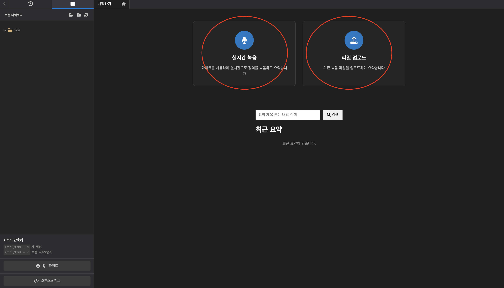
   지금부터 바로 녹음을 한 뒤 요약을 생성하려면 ‘실시간 녹음’ 버튼을, 이미 녹음한 파일이 존재한다면 ‘파일 업로드’ 버튼을 클릭한다.
2. 실시간 녹음 모달  
   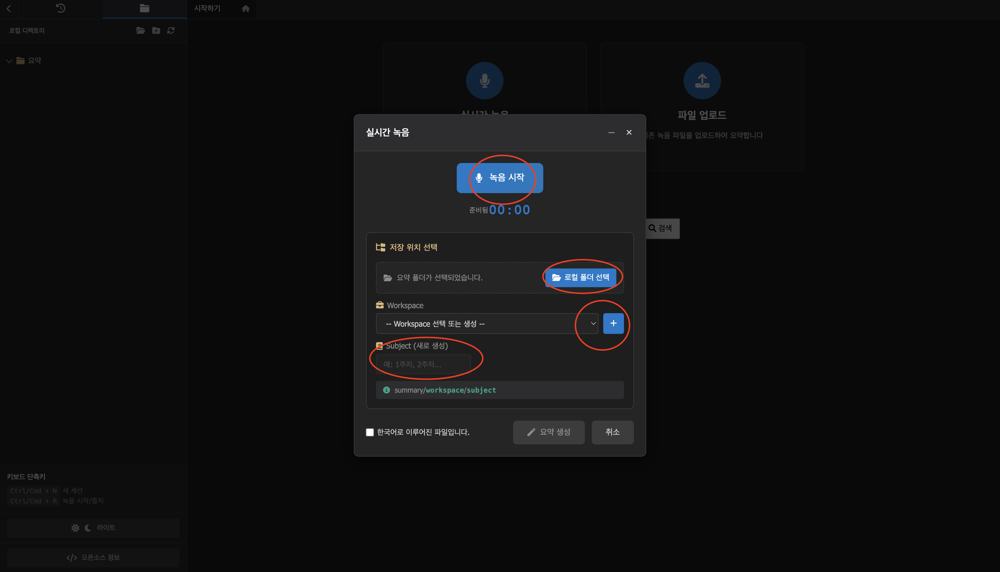
   만약 처음에 폴더를 선택하지 못했다면 이 창에서도 폴더 선택이 가능하다. 그리고 그 다음엔 하위 폴더를 선택한다. 예를 들어 ‘summary’라는 폴더 안에(첫번째 폴더 선택) ‘알고리즘’이라는 폴더를 만들고(두번째 폴더 선택) 마지막으로 ‘1주차’라는 폴더를 선택하면 그 안에 요약파일이 생성된다. summary->알고리즘->1주차안에 요약파일이 생성된다.
3. 녹음 시작 및 최소화  
   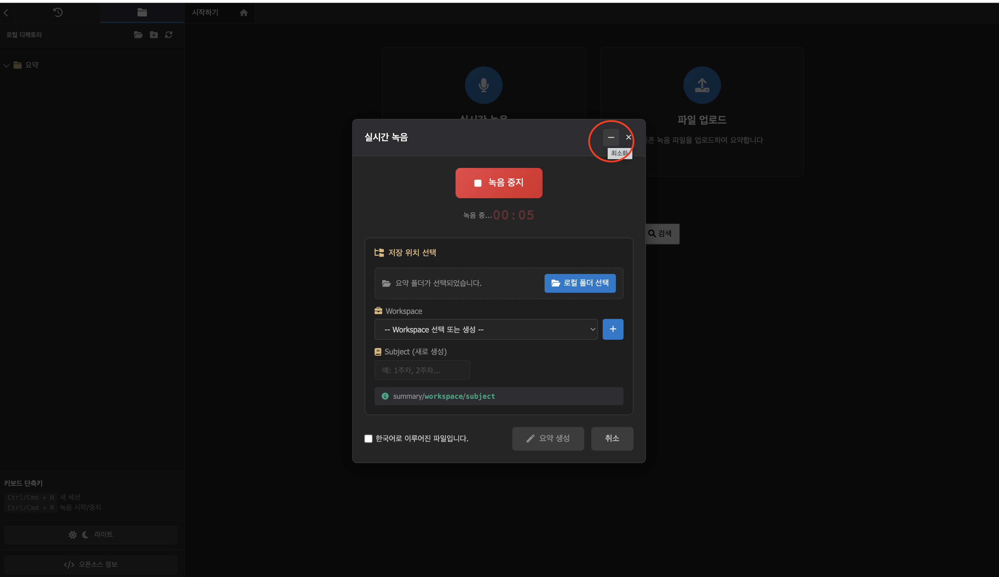
   녹음 시작 후 최소화 버튼을 누를 수 있다. 버튼을 누르면  
     
   우하단 미니바에서 녹음 상태를 보며 다른 요약을 확인할 수 있습니다.
4. 녹음 종료 후 재녹음/요약 생성  
   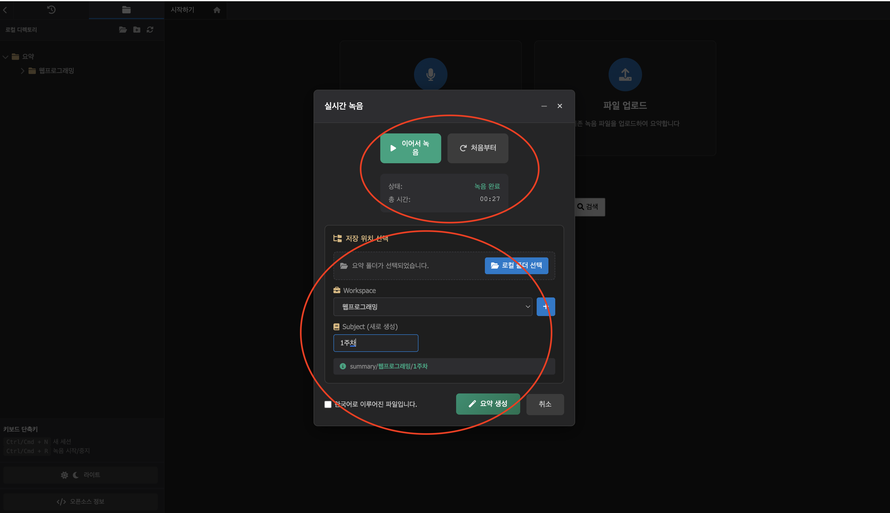
5. 요약 생성 및 저장 결과  
   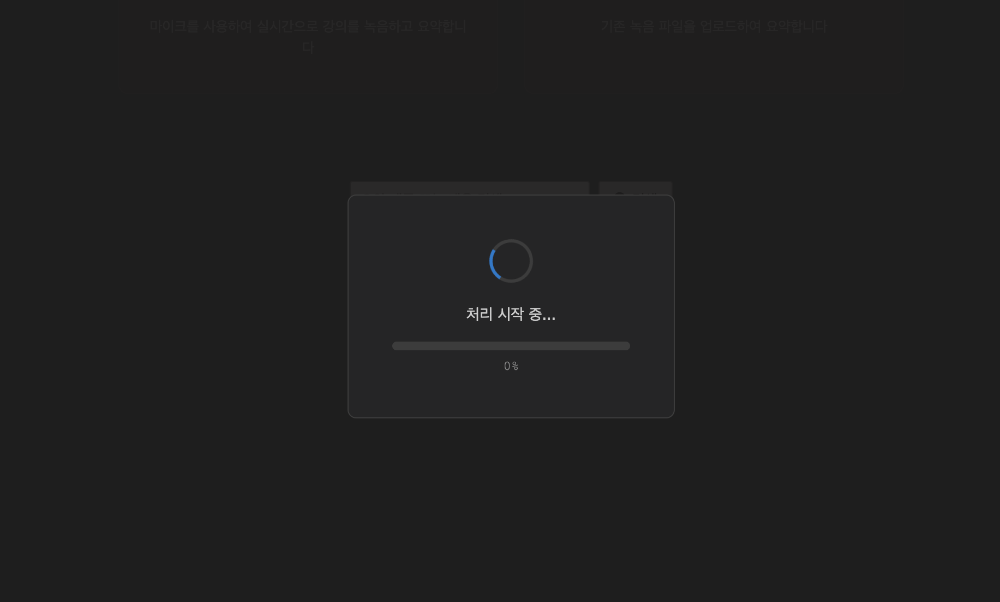
   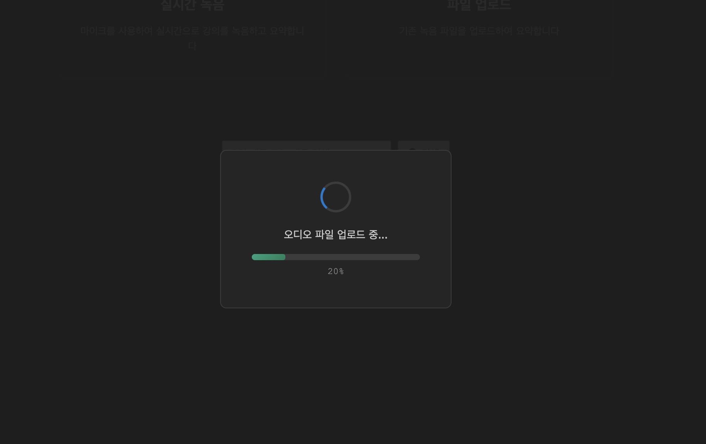
   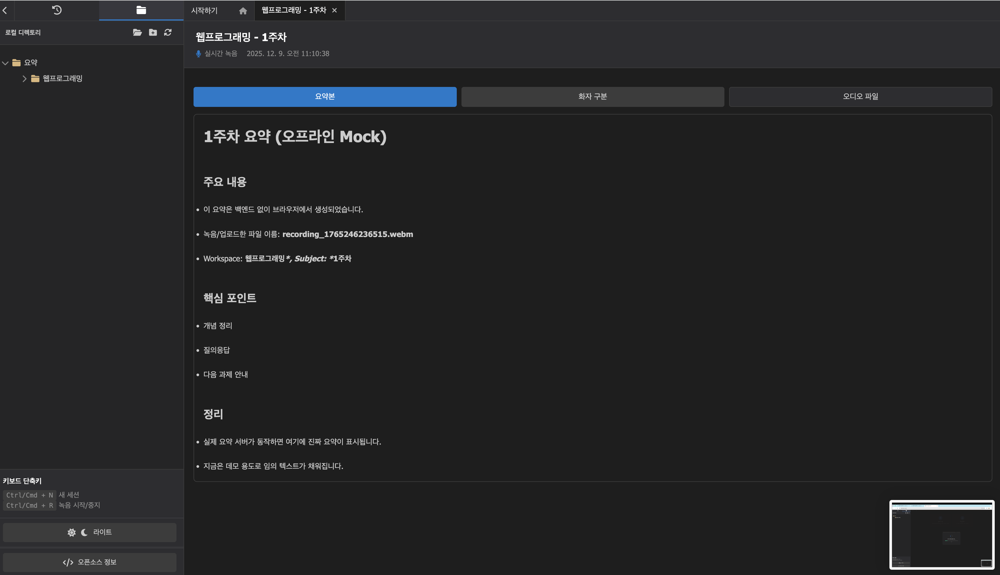
   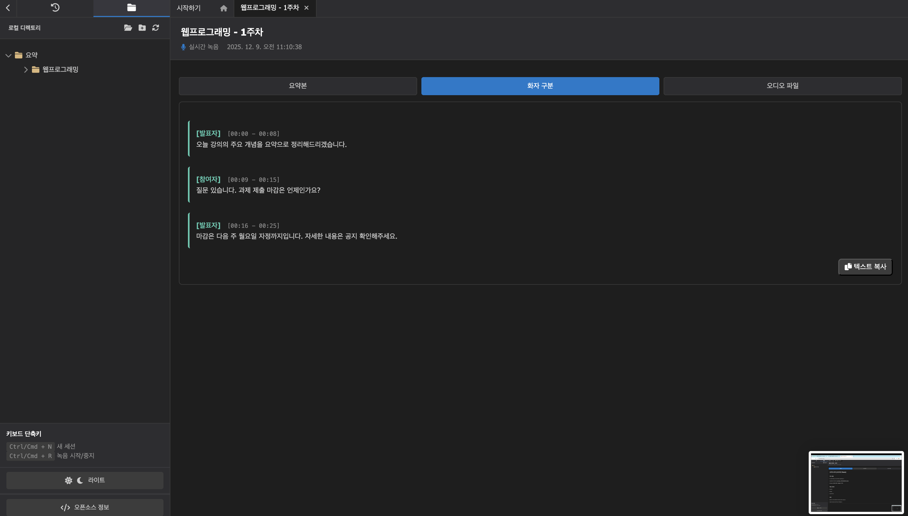
   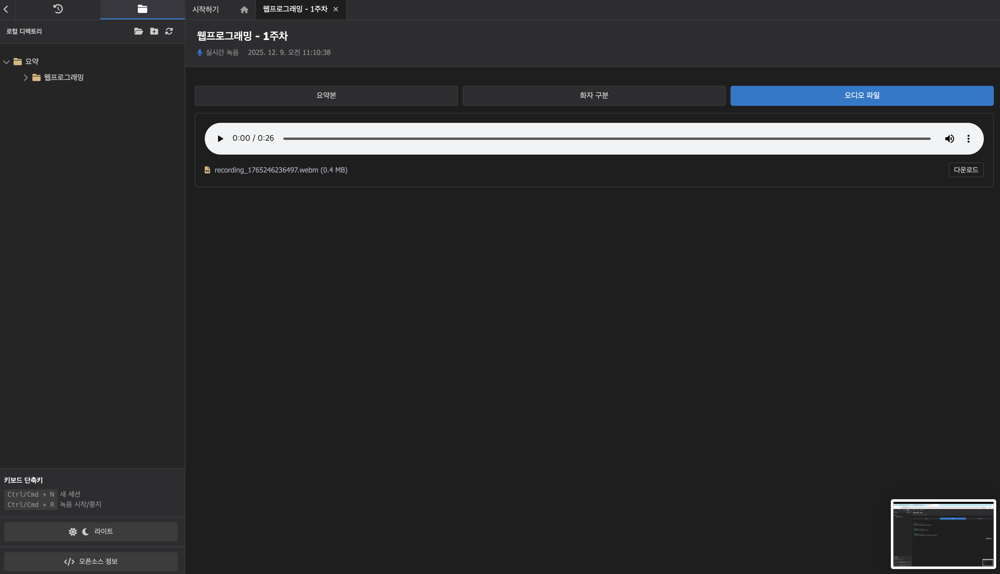
   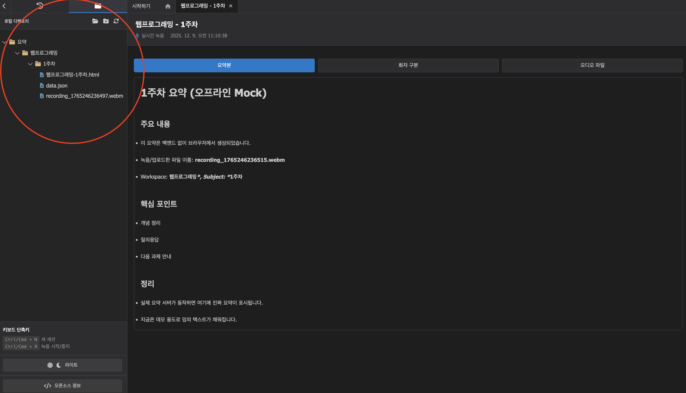  
   `summary/<workspace>/<subject>/` 안에 저장되며, 오른쪽 탭에서 요약본/화자구분/오디오 파일을 확인합니다.
6. 요약 기록/검색/테마 전환  
   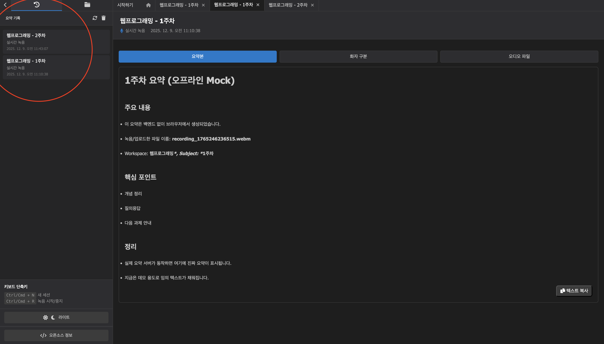  
   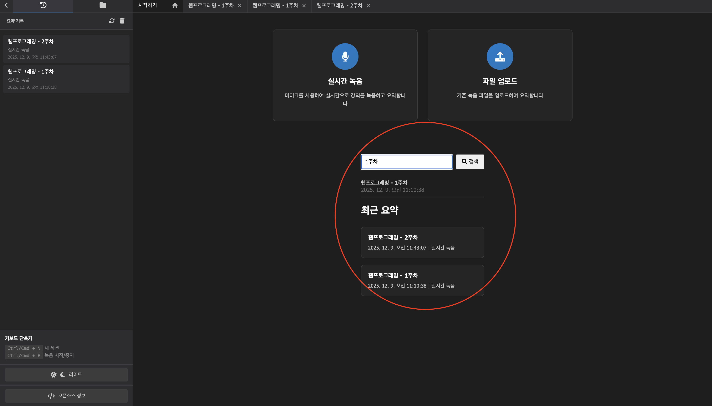  
   최신순 목록, 검색, 라이트/다크 테마 전환을 지원합니다.

## 사용 시 유의사항

- File System Access API는 크롬/엣지의 보안 환경(https 또는 localhost)에서만 허용됩니다.
- 폴더/파일 이름에는 특수문자 사용을 제한하여 OS별 호환성을 유지합니다.
- 브라우저 권한(마이크, 파일 시스템)을 거부하면 녹음/저장 기능이 작동하지 않습니다.

## 문제 해결

- “폴더 열기” 오류: 지원 브라우저인지 확인하고, 권한 팝업을 허용 후 다시 시도합니다.
- 백엔드 연결 실패: 기본 Mock 모드로 자동 전환됩니다. 실제 서버를 쓰려면 위 “백엔드 연동” 절차를 확인하세요.
- 오디오가 재생되지 않음: 업로드/녹음된 파일이 `summary/<workspace>/<subject>/` 안에 저장되었는지, 브라우저가 해당 코덱을 지원하는지 확인하세요.
